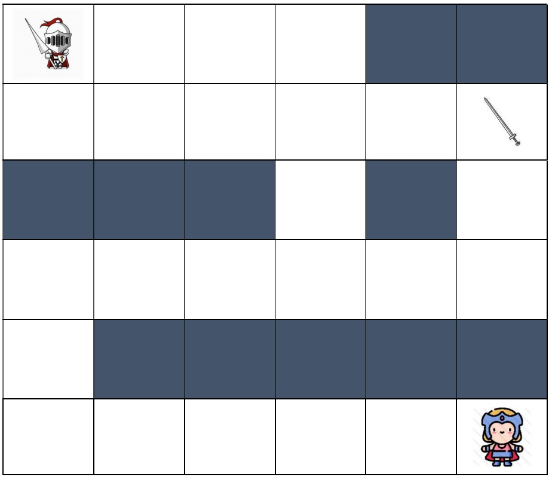

- **문제** : 백준 17836번: 공주님을 구해라!
- **난이도** : 골드 5
- **문제 유형** : BFS
- **푼 언어** : Javascript

## 01. 문제 설명
용사는 마왕이 숨겨놓은 공주님을 구하기 위해 (N, M) 크기의 성 입구 (1,1)으로 들어왔다. 마왕은 용사가 공주를 찾지 못하도록 성의 여러 군데 마법 벽을 세워놓았다. 용사는 현재의 가지고 있는 무기로는 마법 벽을 통과할 수 없으며, 마법 벽을 피해 (N, M) 위치에 있는 공주님을 구출해야만 한다.

마왕은 용사를 괴롭히기 위해 공주에게 저주를 걸었다. 저주에 걸린 공주는 T시간 이내로 용사를 만나지 못한다면 영원히 돌로 변하게 된다. 공주님을 구출하고 프러포즈 하고 싶은 용사는 반드시 T시간 내에 공주님이 있는 곳에 도달해야 한다. 용사는 한 칸을 이동하는 데 한 시간이 걸린다. 공주님이 있는 곳에 정확히 T시간만에 도달한 경우에도 구출할 수 있다. 용사는 상하좌우로 이동할 수 있다.



성에는 이전 용사가 사용하던 전설의 명검 "그람"이 숨겨져 있다. 용사가 그람을 구하면 마법의 벽이 있는 칸일지라도, 단숨에 벽을 부수고 그 공간으로 갈 수 있다. "그람"은 성의 어딘가에 반드시 한 개 존재하고, 용사는 그람이 있는 곳에 도착하면 바로 사용할 수 있다. 그람이 부술 수 있는 벽의 개수는 제한이 없다.

우리 모두 용사가 공주님을 안전하게 구출 할 수 있는지, 있다면 얼마나 빨리 구할 수 있는지 알아보자.

### 입력
첫 번째 줄에는 성의 크기인 N, M 그리고 공주에게 걸린 저주의 제한 시간인 정수 T가 주어진다. 첫 줄의 세 개의 수는 띄어쓰기로 구분된다. (3 ≤ N, M ≤ 100, 1 ≤ T ≤ 10000)

두 번째 줄부터 N+1번째 줄까지 성의 구조를 나타내는 M개의 수가 띄어쓰기로 구분되어 주어진다. 0은 빈 공간, 1은 마법의 벽, 2는 그람이 놓여있는 공간을 의미한다. (1,1)과 (N,M)은 0이다.


### 출력
용사가 제한 시간 T시간 이내에 공주에게 도달할 수 있다면, 공주에게 도달할 수 있는 최단 시간을 출력한다.

만약 용사가 공주를 T시간 이내에 구출할 수 없다면, "Fail"을 출력한다.

## 02. 문제 풀이
이 문제는 **BFS(너비 우선 탐색)** 을 응용하여 해결했다. 특히 조건에 따라 가지치기를 잘해야 효율적으로 해결할 수 있었다. 

일반적인 BFS 문제와 달리, ‘그람(Gram)’을 얻었는지 여부에 따라 이동할 수 있는 경로가 달라지기 때문에, 이를 구분하기 위해 3차원 배열 visited를 사용했다. 
(탐색할 때 다음 칸이 벽(값 1)이라면 그람을 얻지 않은 상태에서는 이동할 수 없고, 그람을 얻은 상태라면 벽을 자유롭게 통과할 수 있다.)

탐색 도중 공주가 있는 위치 (N-1, M-1)에 도달하면 즉시 종료하고, 그때까지의 시간을 출력한다. 만약 BFS 탐색이 끝나거나, 제한 시간 T가 지나도록 공주를 구하지 못하면 "Fail"을 출력한다.


<코드>
``` javascript
const fs = require('fs')
const filePath = process.platform === 'linux' ? 'dev/stdin' : '17836_input.txt'
const [[N, M, T], ...castleMap] = fs.readFileSync(filePath)
  .toString()
  .trim()
  .split('\n')
  .map((line) => line.split(' ').map(Number))

const directions = [[0, 1], [1, 0], [0, -1], [-1, 0]]

// visited[r][c][g] : g=0(그람X), g=1(그람O) 일 때 (r,c)까지 걸린 시간
const visited = Array.from({ length: N }, () =>
  Array.from({ length: M }, () => Array(2).fill(-1))
)
visited[0][0][0] = 0

const q = [[0, 0, 0]]  // [r, c, 그람 유무]
let front = 0
let isEnd = false
let ans = 0

while (q.length > front) {
  const [r, c, hasGram] = q[front++]
  const t = visited[r][c][hasGram]

  for ( const [dr, dc] of directions ) {
    const nr = dr + r
    const nc = dc + c

    if ( 0 > nr || nr >= N || 0 > nc || nc >= M || visited[nr][nc][hasGram] !== -1 ) continue

    if ( castleMap[nr][nc] === 1 && hasGram === 0 ) continue   // 벽이지만, 그람을 먹으면 탐색 가능
    
    let ng = hasGram
    if (castleMap[nr][nc] === 2) ng = 1

    visited[nr][nc][ng] = t + 1
    
    // 종료조건
    if (nr === N-1 && nc === M-1) {
      ans = visited[nr][nc][ng]
      isEnd = true
      break
    }
    if (visited[nr][nc][ng] < T) q.push([nr, nc, ng])
  }
  if (isEnd) break
}

console.log(ans !== 0 ? ans : 'Fail')
```