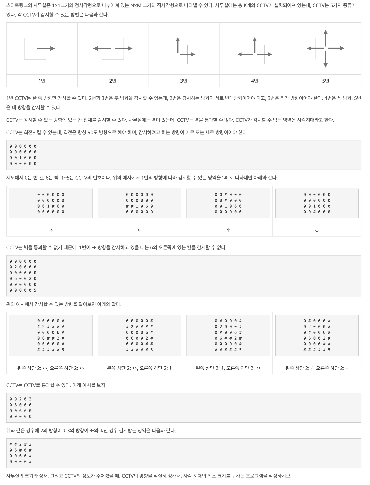

- **문제** : 백준 15683번 : 감시
- **난이도** : 골드 3
- **문제 유형** : 브루트 포스
- **푼 언어** : Javascript

## 01. 문제 설명


### 입력
첫째 줄에 사무실의 세로 크기 N과 가로 크기 M이 주어진다. (1 ≤ N, M ≤ 8)

둘째 줄부터 N개의 줄에는 사무실 각 칸의 정보가 주어진다. 0은 빈 칸, 6은 벽, 1~5는 CCTV를 나타내고, 문제에서 설명한 CCTV의 종류이다. 

CCTV의 최대 개수는 8개를 넘지 않는다.

### 출력
첫째 줄에 사각 지대의 최소 크기를 출력한다.

## 02. 문제 풀이 
watchSet 함수는 특정 CCTV의 위치와 방향 조합(dirs)을 받아, 벽(0 or 6 or (N or M))을 만나기 전까지 직선으로 이동하며 감시할 수 있는 모든 칸을 탐색한다. 감시할 수 있는 빈 칸(0)을 만나면 "x,y" 문자열 형태로 Set에 추가하여 중복 없이 관리한다. 이 함수를 통해 CCTV 하나가 각 방향 조합으로 감시할 수 있는 영역이 Set 형태로 반환된다.

이후 이 정보를 바탕으로 cctvOptions 배열을 만든다. 이는 모든 CCTV에 대해 가능한 모든 감시 방향 조합을 저장한 2차원 배열로, cctvOptions[i]는 i번째 CCTV가 가질 수 있는 시야 조합들을 담고 있다. 동시에, 전체 사무실에서의 빈 칸 개수(blind)도 미리 세어둔다.

다음으로 핵심 탐색 함수인 dfs(depth, covered)는 완전탐색(DFS)을 이용해 모든 CCTV의 방향 조합을 시도한다.
	•	depth는 현재 고려 중인 CCTV의 인덱스이며,
	•	covered는 지금까지 감시된 칸들의 집합이다.

모든 CCTV의 방향이 정해졌다면(depth === cctvOptions.length), covered.size를 이용해 감시된 칸의 개수를 계산하고, 이를 통해 maxCovered 값을 갱신한다.
그 외의 경우에는 현재 CCTV의 가능한 모든 방향 조합(curSet)을 순회하면서, 기존 감시 영역(covered)과 새롭게 감시된 영역(curSet)을 합쳐 다음 깊이로 재귀 호출한다.

모든 조합 탐색이 끝나면, maxCovered에는 CCTV들이 감시할 수 있는 최대 영역의 크기가 저장된다. 마지막으로 전체 빈 칸 수(blind)에서 감시된 칸 수(maxCovered)를 뺀 값이 최소 사각지대의 크기이므로, console.log(blind - maxCovered)를 통해 결과를 출력한다.

<코드>
```javascript
const fs = require('fs')
const filePath = process.platform === 'linux' ? 'dev/stdin' : '15683_input.txt'
const [ [N, M], ...room ] = fs.readFileSync(filePath)
  .toString()
  .trim()
  .split('\n')
  .map((line) => line.split(' ').map(Number))

const DIRECTIONS = [[0, 1], [0, -1], [1, 0], [-1, 0]]
const CCTV_VIEW = {
  1:[[0], [1], [2], [3]],
  2:[[0, 1], [2, 3]],
  3:[[0, 2], [0, 3], [1, 2], [1, 3]],
  4:[[0, 1, 2], [0, 1, 3], [2, 3, 0], [2, 3, 1]],
  5:[[0, 1, 2, 3]]
}

// CCTV가 볼 수 있는 한 방향 시야 계산하는 함수
const watchSet = ( x, y, dirs ) => {
  let res = new Set()
  for ( const dir of dirs ) {
    const [dx, dy] = DIRECTIONS[dir]
    let [nx, ny] = [dx + x, dy + y]
    while ( ( 0 <= nx && nx < N && 0 <= ny && ny < M ) && room[nx][ny] !== 6 ) {
      if ( room[nx][ny] === 0 ) res.add(`${nx},${ny}`)
      nx += dx
      ny += dy
    }
  }


  return res
}

const cctvOptions = []   // CCTV 시야범위 배열 
let blind = 0       // 빈 공간 개수

for ( let r = 0; r < N; r++ ) {
  for ( let c = 0; c < M; c++ ) {
    if ( room[r][c] === 0 ) {
      blind ++
    } 
    else if ( room[r][c] !== 6 ) {
      // 현재 CCTV의 시야범위 계산
      const cctvNum = room[r][c]
      const opts = []
      for ( let cctvDir of CCTV_VIEW[cctvNum] ) {
        opts.push(watchSet(r, c, cctvDir))
      }
      cctvOptions.push(opts)
    }
  }
}


let maxCovered = 0

const dfs = ( depth, coverd ) => {
  if ( depth === cctvOptions.length ) {
    maxCovered = Math.max( maxCovered, coverd.size )
    return
  }

  for ( let curSet of cctvOptions[depth] ) {
    const nextSet = new Set(coverd)
    for ( const key of curSet ) nextSet.add(key) 

    dfs( depth + 1, nextSet )
  }
}


dfs( 0, new Set() )
console.log(blind - maxCovered)
```
