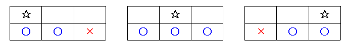

- **문제** : 백준 2096번 - 내려가기   
- **난이도** : 골드 5
- **문제 유형** : DP
- **푼 언어** : Python

## 01. 문제 설명
N줄에 0 이상 9 이하의 숫자가 세 개씩 적혀 있다. 내려가기 게임을 하고 있는데, 이 게임은 첫 줄에서 시작해서 마지막 줄에서 끝나게 되는 놀이이다.

먼저 처음에 적혀 있는 세 개의 숫자 중에서 하나를 골라서 시작하게 된다. 그리고 다음 줄로 내려가는데, 다음 줄로 내려갈 때에는 다음과 같은 제약 조건이 있다. 바로 아래의 수로 넘어가거나, 아니면 바로 아래의 수와 붙어 있는 수로만 이동할 수 있다는 것이다. 이 제약 조건을 그림으로 나타내어 보면 다음과 같다.



별표는 현재 위치이고, 그 아랫 줄의 파란 동그라미는 원룡이가 다음 줄로 내려갈 수 있는 위치이며, 빨간 가위표는 원룡이가 내려갈 수 없는 위치가 된다. 숫자표가 주어져 있을 때, 얻을 수 있는 최대 점수, 최소 점수를 구하는 프로그램을 작성하시오. 점수는 원룡이가 위치한 곳의 수의 합이다.

### 입력 
첫째 줄에 N(1 ≤ N ≤ 100,000)이 주어진다. 다음 N개의 줄에는 숫자가 세 개씩 주어진다. 숫자는 0, 1, 2, 3, 4, 5, 6, 7, 8, 9 중의 하나가 된다.

### 출력 
첫째 줄에 얻을 수 있는 최대 점수와 최소 점수를 띄어서 출력한다.


## 02. 문제 풀이
이 문제는 각 줄마다 세 개의 숫자 중 하나를 선택해 내려오면서, **최대 점수**와 **최소 점수**를 구하는 문제이다. DP 알고리즘을 사용해서 문제를 해결하였다.

### 2-1. DP를 사용한 이유
이 문제는 각 줄마다 선택한 위치에 따라 다음 줄에서 이동할 수 있는 위치가 제한된다.  
즉 이전 줄에서의 선택이 다음 줄의 계산에 직접적인 영향을 미치는 것을 알 수 있다. 또한 동일한 상태에 대한 계산이 반복되기 때문에, 동적 계획법(DP)을 사용하는 것이 효과적이다.

현재 줄에서 어떤 위치를 선택했는지에 따라 다음 줄에서 이동할 수 있는 위치는 다음과 같다.

- **왼쪽(0번 열)** → 다음 줄의 0번, 1번 열
- **가운데(1번 열)** → 다음 줄의 0번, 1번, 2번 열
- **오른쪽(2번 열)** → 다음 줄의 1번, 2번 열

이때 `prevMax[i]`를 **이전 줄의 i번째 열까지 내려왔을 때 얻을 수 있는 최대 점수**라고 정의하고, 현재 줄의 값이 `(a0, a1, a2)`일 때 최댓값에 대한 점화식은 다음과 같다.
```
- newMax[0] = a0 + max(prevMax[0], prevMax[1])
- newMax[1] = a1 + max(prevMax[0], prevMax[1], prevMax[2])
- newMax[2] = a2 + max(prevMax[1], prevMax[2])
```
(최솟값도 비슷하기 때문에 생략한다)

### 2-2. 최적화 방안
이 문제에서 DP 테이블 전체를 저장할 필요는 없다. 각 줄의 계산에 필요한 것은 **바로 이전 줄의 계산**이기 때문에, 가장 큰 값들만 저장하는 `maxMemo`와 가장 작은 값들만 저장하는 `minMemo`를 크기 3의 1차원 배열로 생성하였다. 이후 해당 배열의 값을 매 순간 갱신하였다. 이를 통해 공간 복잡도를 크게 줄일 수 있었다.

### 2-3. 결과
모든 계산이 끝난 후 마지막에 `maxMemo`에서 가장 큰 값을, `minMemo`에서 가장 작은 값을 출력하면 된다.

<코드>
```python
import sys 
input = sys.stdin.readline
# sys.stdin = open('BOJ2096_input_1.txt', 'r')

N = int(input())
first_line = list(map(int, input().split()))
maxMemo = first_line
minMemo = first_line


# dp 계산 
for r in range(N-1) :
  cur_line = list(map(int, input().split()))
  maxMemo = [cur_line[0] + max(maxMemo[0], maxMemo[1]), 
              cur_line[1] + max(maxMemo), 
              cur_line[2] + max(maxMemo[1], maxMemo[2])]
  
  minMemo = [cur_line[0] + min(minMemo[0], minMemo[1]), 
              cur_line[1] + min(minMemo), 
              cur_line[2] + min(minMemo[1], minMemo[2])]

print(max(maxMemo), min(minMemo))
```
## 03. 회고
- 자바스크립트는 어떠한 방법으로도 메모리 초과가 발생하였다. 어디서 메모리 누수가 발생하는 것 같은데 현재 내 지식으로는 해결할 수가 없었다. 아마 max와 min 계산, 그리고 배열의 값을 저장하는 방식에서 메모리가 생각보다 많이 나오는 것으로 생각되는 데 한번 찾아봐야할 것 같다. 그게 아니라면 parseInt와 Number 타입에서 메모리 차이가 발생하는 것 같다. 나중에 기회가 되면 분석해봐야겠다.


