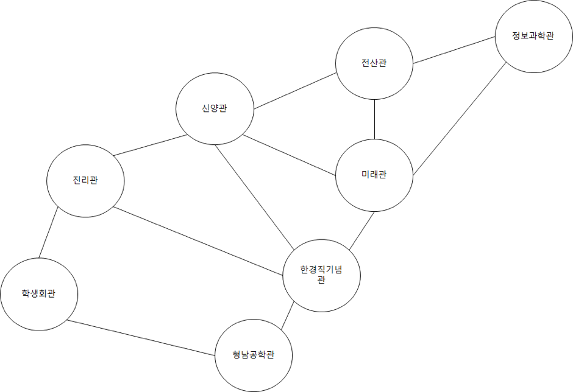

- **문제** : 백준 12850번 - 본대 산책2
- **난이도** : 플래티넘 5
- **문제 유형** : 분할 정복
- **푼 언어** : python

## 01. 문제 설명
숭실 대학교 정보 과학관은 유배를 당해서  캠퍼스의 길 건너편에 있다. 그래서 컴퓨터 학부 학생들은 캠퍼스를 ‘본대’ 라고 부르고 정보 과학관을 ‘정보대’ 라고 부른다. 준영이 또한 컴퓨터 학부 소속 학생이라서 정보 과학관에 박혀있으며 항상 꽃 이 활짝 핀 본 대를 선망한다. 어느 날 준영이는 본 대를 산책하기로 결심하였다. 숭실 대학교 캠퍼스 지도는 아래와 같다.



(편의 상 문제에서는 위 건물만 등장한다고 가정하자)

한 건물에서 바로 인접한 다른 건물로 이동 하는 데 1분이 걸린다. 준영이는 산책 도중에 한번도 길이나 건물에 멈춰서 머무르지 않는다. 준영이는 할 일이 많아서 딱 D분만 산책을 할 것이다. (산책을 시작 한 지 D분 일 때, 정보 과학관에 도착해야 한다.) 이때 가능한 경로의 경우의 수를 구해주자.

### 입력
D 가 주어진다 (1 ≤ D ≤ 1,000,000,000) 

### 출력
가능한 경로의 수를 1,000,000,007로 나눈 나머지를 출력한다.

## 02. 문제 풀이
인접행렬의 성질을 이용해서 문제를 해결하였다

1. 그림을 참고하여 그래프를 생성하였다. 위에서부터 아래 순으로, 왼쪽에서 오른쪽으로 인덱스를 부여하였다.
 - 정보 과학관 : 0
 - 전산관 : 1
 - 신앙관 : 2
 - 미래관 : 3
 - 진리관 : 4
 - 한경직 기념관 : 5
 - 학생회관 : 6
 - 형남공학관 : 7

2. 분할 정복 알고리즘을 사용하여 n을 최소한으로 나눈다.
본래 경로의 수를 구하기 위해서는 행렬을 n번 곱해야 한다. 분할 정복은 문제를 작은 단위로 쪼개서 해결한 뒤, 그 결과를 재사용하여 전체 문제를 빠르게 해결하는 알고리즘이다. n을 더 이상 나눌 수 없을 때까지 2로 계속 나누면서 부분 문제를 만든 후, 이전에 계산한 값을 재활용함으로써 전체 연산량을 크게 줄일 수 있다.

3. n을 나눌 수 없을 만큼 나눴다면 배열 곱셈을 실행한다.

  <코드>
  ```python
D = int(input())
MOD = 1_000_000_007

graph = [[0] * 8 for _ in range(8)]
graph[0][1] = graph[0][3] = 1
graph[1][0] = graph[1][2] = graph[1][3] = 1
graph[2][1] = graph[2][3] = graph[2][4] = graph[2][5] = 1
graph[3][0] = graph[3][1] = graph[3][2] = graph[3][5] = 1
graph[4][2] = graph[4][5] = graph[4][6] = 1
graph[5][2] = graph[5][3] = graph[5][4] = graph[5][7] = 1
graph[6][4] = graph[6][7] = 1
graph[7][5] = graph[7][6] = 1

def divide(arr, n):
    if n == 1:
        return arr
    half = divide(arr, n // 2)
    half_sq = multiply(half, half)
    if n % 2 == 0:
        return half_sq

    else :
        return multiply(half_sq, arr)

def multiply(arr1, arr2):
    result = [[0] * 8 for _ in range(8)]
    for i in range(8):
        for j in range(8):
            for k in range(8):
                result[i][j] += arr1[i][k] * arr2[k][j]
            result[i][j] %= MOD
    return result

ans = divide(graph, D)
print(ans[0][0])
```
## 03. 회고
