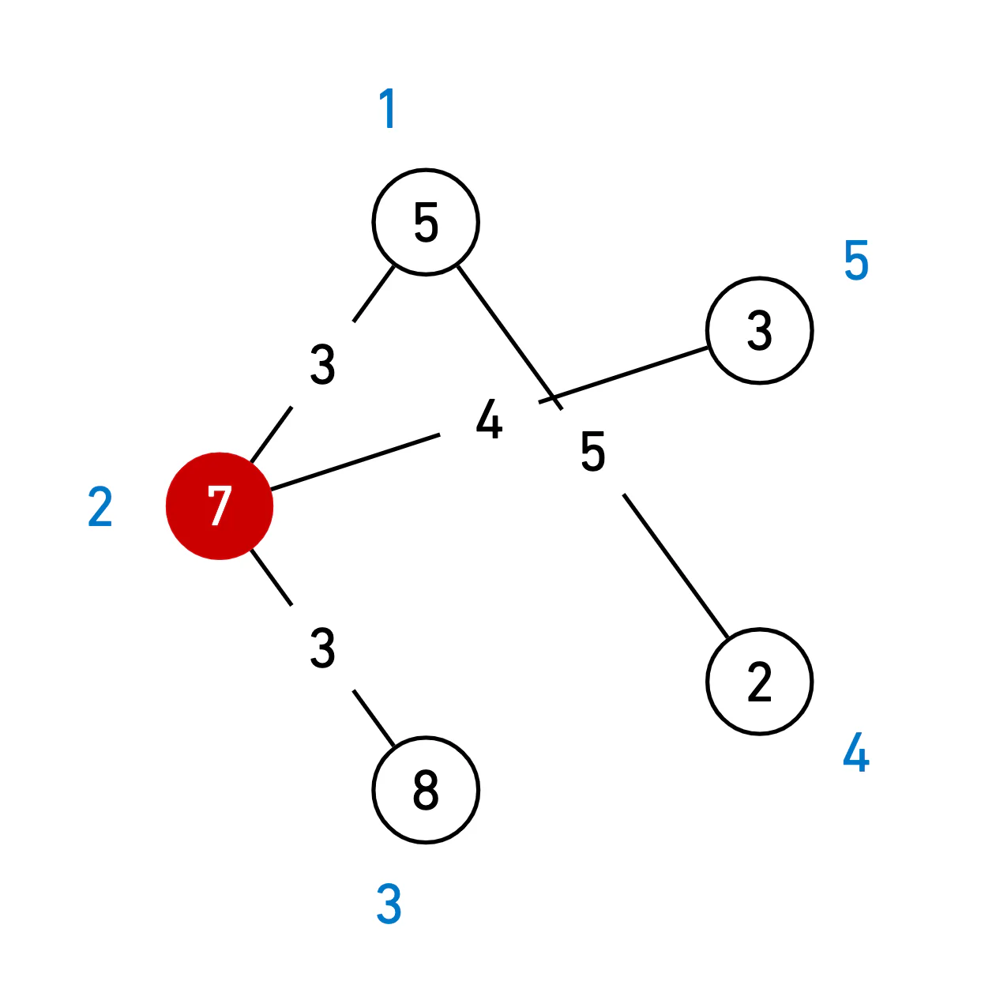

- **문제** : 백준 14938 - 서강그라운드
- **난이도** : 골드 4
- **문제 유형** : 풀루이드 워셜
- **푼 언어** : Python

## 01. 문제 설명
예은이는 요즘 가장 인기가 있는 게임 서강그라운드를 즐기고 있다. 서강그라운드는 여러 지역중 하나의 지역에 낙하산을 타고 낙하하여, 그 지역에 떨어져 있는 아이템들을 이용해 서바이벌을 하는 게임이다. 서강그라운드에서 1등을 하면 보상으로 치킨을 주는데, 예은이는 단 한번도 치킨을 먹을 수가 없었다. 자신이 치킨을 못 먹는 이유는 실력 때문이 아니라 아이템 운이 없어서라고 생각한 예은이는 낙하산에서 떨어질 때 각 지역에 아이템 들이 몇 개 있는지 알려주는 프로그램을 개발을 하였지만 어디로 낙하해야 자신의 수색 범위 내에서 가장 많은 아이템을 얻을 수 있는지 알 수 없었다.

각 지역은 일정한 길이 l (1 ≤ l ≤ 15)의 길로 다른 지역과 연결되어 있고 이 길은 양방향 통행이 가능하다. 예은이는 낙하한 지역을 중심으로 거리가 수색 범위 m (1 ≤ m ≤ 15) 이내의 모든 지역의 아이템을 습득 가능하다고 할 때, 예은이가 얻을 수 있는 아이템의 최대 개수를 알려주자.

주어진 필드가 위의 그림과 같고, 예은이의 수색범위가 4라고 하자. ( 원 밖의 숫자는 지역 번호, 안의 숫자는 아이템 수, 선 위의 숫자는 거리를 의미한다) 예은이가 2번 지역에 떨어지게 되면 1번,2번(자기 지역), 3번, 5번 지역에 도달할 수 있다. (4번 지역의 경우 가는 거리가 3 + 5 = 8 > 4(수색범위) 이므로 4번 지역의 아이템을 얻을 수 없다.) 이렇게 되면 예은이는 23개의 아이템을 얻을 수 있고, 이는 위의 필드에서 예은이가 얻을 수 있는 아이템의 최대 개수이다.


### 입력
첫째 줄에는 지역의 개수 n (1 ≤ n ≤ 100)과 예은이의 수색범위 m (1 ≤ m ≤ 15), 길의 개수 r (1 ≤ r ≤ 100)이 주어진다.

둘째 줄에는 n개의 숫자가 차례대로 각 구역에 있는 아이템의 수 t (1 ≤ t ≤ 30)를 알려준다.

세 번째 줄부터 r+2번째 줄 까지 길 양 끝에 존재하는 지역의 번호 a, b, 그리고 길의 길이 l (1 ≤ l ≤ 15)가 주어진다.

지역의 번호는 1이상 n이하의 정수이다. 두 지역의 번호가 같은 경우는 없다.
### 출력
예은이가 얻을 수 있는 최대 아이템 개수를 출력한다.

## 02. 문제 풀이
이 문제는 모든 지역 간의 최단 거리를 구한 뒤, 각 지역을 시작점으로 했을 때 수색 범위(M) 이내에서 얻을 수 있는 아이템의 총합을 계산하여, 그 중 최대값을 찾는 문제이다.

이를 효율적으로 해결하기 위해 **플로이드–워셜(Floyd–Warshall)** 알고리즘을 사용하였다.
이 알고리즘은 모든 정점 쌍 간의 최단 거리를 구하는 대표적인 알고리즘으로, O(N³)의 시간 복잡도를 가진다.

모든 지역 간의 최단 거리를 갱신한다. 중간 노드 m을 거쳐 가는 경우가 더 짧은 경로라면, 기존 거리보다 작은 값으로 갱신한다. 이렇게 하면 최종적으로 `dist[i][j]`에는 지역 i에서 j로 가는 최단 거리가 저장된다. 
최단 거리 계산이 끝나면, 각 지역을 시작점으로 가정하여 수색 범위 M 이내에 도달할 수 있는 모든 지역의 아이템 수를 합산한다. 이때, `dist[i][j]`가 M 이하인 지역의 아이템 개수를 모두 더하고, 그 중 가장 큰 값을 결과로 선택한다.

마지막으로 예은이가 얻을 수 있는 아이템의 최대 개수를 출력한다.

<코드>
``` python
import sys
input = sys.stdin.readline

N, M, R = map(int, input().split()) # 지역의 개수, 수색범위, 길의 개수
item_cnts = list(map(int, input().split()))  # 구역 별 아이템 개수
INF = 3001

dist = [[INF] * (N + 1) for _ in range(N + 1)]

for _ in range(R):
    a, b, d = map(int, input().split())
    dist[a][b] = d
    dist[b][a] = d

for i in range(N+1):
    dist[i][i] = 0

for m in range(1, N+1):
    for i in range(1, N+1):
        for j in range(1, N+1):
            dist[i][j] = min(dist[i][j], dist[i][m] + dist[m][j])
ans = 0
for i in range(1, N+1):
    tmp = 0
    for j in range(1, N+1):
        if dist[i][j] <= M:
           tmp += item_cnts[j-1]
    ans = max(ans, tmp)

print(ans)
```
