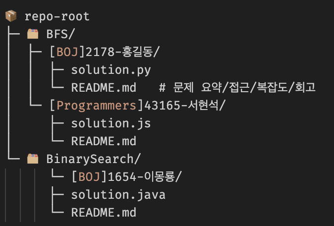

# 매알고 (매일 알고리즘)

매알고는 꾸준히 문제를 푸는 것을 목표로 하는 알고리즘 문제 풀이 스터디입니다. “꾸준함”을 최우선 가치로 두고, 풀이 과정과 회고를 기록합니다.

## 1. 규칙 
1. ~~**평일 매일 1문제**를 풀고 깃 저장소에 업로드합니다. (주말은 자유)~~
일주일에 본인이 지정한 세 문제를 풀고 깃 저장소에 업로드합니다. (2025.11.17 수정)
2.	본인이 사용한 **풀이 유형(예: BFS, DFS, 이분 탐색 등)으로 분류**합니다. 해당 유형 폴더가 없으면 새로 만듭니다.
3.	**업로드 시 디렉터리를 생성해 올립니다.** 디렉터리명은 다음 규칙을 따릅니다:
	•	형식: [사이트][문제번호]-[문제 이름(한글)]
	•	예시: [BOJ]15724-주지수, [Programmers]43105번-정수 삼각형
4. 본인 이름의 브랜치를 생성한 뒤 문제를 올리고, 이후 메인 저장소에 병합합니다. (예: 현석, 환...)
5. 매주 월요일마다 3문제씩 지정해서 단톡방 게시글에 올립니다.

## 2. 저장소 구조
유형별로 최상위 폴더를 두고, 그 아래 문제별 폴더를 생성하는 방식을 권장합니다.

## 3. 파일/디렉터리 네이밍 규칙
-	디렉터리명: [사이트][문제번호]-[이름(한글)]
    예) [BOJ]15724-주지수, [Programmers]43105번-정수 삼각형
-	해당 폴더 내부 기본 파일
    -	solution.[py|js|java|cpp] (언어 자유)
    -	README.md (문제/접근/회고 템플릿 사용)

## 4. README 작성 규칙
-	제목: [사이트]문제번호 - 이름
-  난이도
- 문제 링크
- 푼 언어
- 문제 설명
-	풀이 아이디어 
- 코드
-	(선택) 회고: 무엇이 막혔고 어떻게 뚫었는지

자세한 README 예시는 템플릿 참고

---

<strong>민 진행사항</strong>

 

| Week (Date)        | Count | Details |
|--------------------|--------|---------|
| **1 (9/22 ~ 9/28)** | 5 | 

문제 보기
- 사다리 조작 - 맥주 마시면서 걸어가기 - 노드 사이의 거리 - 민서의 응급 수술 - 소수의 연속합
 |
| **2 (9/29 ~ 10/5)** | 4 | 

문제 보기
- 다이어트 - 동전 뒤집기 - 경사로 - 강의실 배정
 |
| **3 (10/6 ~ 10/12)** | 2 | 

문제 보기
- 톱니바퀴 - 파일합치기 3
 |
| **4 (10/13 ~ 10/19)** | 4 | 

문제 보기
- 줄 세우기 - 벽 부수고 이동하기 3 - 다리만들기 - 기타 레슨
 |
| **5 (10/20 ~ 10/26)** | 5 | 

문제 보기
- 트리의 높이와 너비 - 문자열 폭발 - 컵라면 - 휴게소 세우기 - 트리 색칠하기
 |
| **6 (10/27 ~ 11/2)** | 6 | 

문제 보기
- 멀티탭 스케줄링 - 알고스팟 - 옥상 정원 꾸미기 - 도시 분할 계획 - 스타트와 링크 - 링크와 스타트
 |
| **7 (11/3 ~ 11/9)** | 10 | 

문제 보기
- 가장 긴 증가하는 부분 수열 - 가장 긴 증가하는 부분 수열 2 - 가장 긴 증가하는 부분 수열 4 - 가장 긴 증가하는 부분 수열 5 - 드래곤 앤 던전 - 안테나 - ⚾ - 가르침 - 점수따먹기 - 태상이의 훈련소 생활
 |
| **8 (11/10 ~ 11/16)** | 9 | 

문제 보기
- 전화번호목록 - A와 B - 연속부분최대곱 - 11월 11일 - 귀여운 라이언 - List of Unique Numbers - 너의 수능 점수가 궁금해 - 타임머신 - 웜홀
 |
| **9 (11/17 ~ 11/23)** | 7 | 

문제 보기
- 도로포장 - 계란으로 계란치기 - 미세먼지 안녕! - 책 나눠주기 - Gaaaaaaaaaaaarden - 낚시왕 - 이차원 배열과 연산
 |

 

