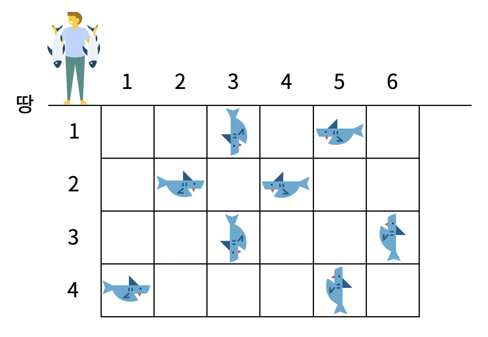

- **문제** : 백준 17143_낚시왕
- **난이도** : 골드 1
- **문제 유형** : 구현
- **푼 언어** : python

## 01. 문제 설명
낚시왕이 상어 낚시를 하는 곳은 크기가 R×C인 격자판으로 나타낼 수 있다. 격자판의 각 칸은 (r, c)로 나타낼 수 있다. r은 행, c는 열이고, (R, C)는 아래 그림에서 가장 오른쪽 아래에 있는 칸이다. 칸에는 상어가 최대 한 마리 들어있을 수 있다. 상어는 크기와 속도를 가지고 있다.



낚시왕은 처음에 1번 열의 한 칸 왼쪽에 있다. 다음은 1초 동안 일어나는 일이며, 아래 적힌 순서대로 일어난다. 낚시왕은 가장 오른쪽 열의 오른쪽 칸에 이동하면 이동을 멈춘다.

낚시왕이 오른쪽으로 한 칸 이동한다.
낚시왕이 있는 열에 있는 상어 중에서 땅과 제일 가까운 상어를 잡는다. 상어를 잡으면 격자판에서 잡은 상어가 사라진다.
상어가 이동한다.
상어는 입력으로 주어진 속도로 이동하고, 속도의 단위는 칸/초이다. 상어가 이동하려고 하는 칸이 격자판의 경계를 넘는 경우에는 방향을 반대로 바꿔서 속력을 유지한채로 이동한다.

왼쪽 그림의 상태에서 1초가 지나면 오른쪽 상태가 된다. 상어가 보고 있는 방향이 속도의 방향, 왼쪽 아래에 적힌 정수는 속력이다. 왼쪽 위에 상어를 구분하기 위해 문자를 적었다.


상어가 이동을 마친 후에 한 칸에 상어가 두 마리 이상 있을 수 있다. 이때는 크기가 가장 큰 상어가 나머지 상어를 모두 잡아먹는다.

낚시왕이 상어 낚시를 하는 격자판의 상태가 주어졌을 때, 낚시왕이 잡은 상어 크기의 합을 구해보자.

### 입력
첫째 줄에 격자판의 크기 R, C와 상어의 수 M이 주어진다. (2 ≤ R, C ≤ 100, 0 ≤ M ≤ R×C)

둘째 줄부터 M개의 줄에 상어의 정보가 주어진다. 상어의 정보는 다섯 정수 r, c, s, d, z (1 ≤ r ≤ R, 1 ≤ c ≤ C, 0 ≤ s ≤ 1000, 1 ≤ d ≤ 4, 1 ≤ z ≤ 10000) 로 이루어져 있다. (r, c)는 상어의 위치, s는 속력, d는 이동 방향, z는 크기이다. d가 1인 경우는 위, 2인 경우는 아래, 3인 경우는 오른쪽, 4인 경우는 왼쪽을 의미한다.

두 상어가 같은 크기를 갖는 경우는 없고, 하나의 칸에 둘 이상의 상어가 있는 경우는 없다.

### 출력
낚시왕이 잡은 상어 크기의 합을 출력한다.

## 02. 문제 풀이
**왕복 주기**를 계산해 모든 상어의 위치를 빠르게 위치를 구한다. 
세로 방향 이동은 주기 `R2 = 2*(R-1)`, 가로 방향 이동은 주기 `C2 = 2*(C-1)`로 계산된다. 따라서 `(현재좌표 + 속도*방향) % 주기`로 최종 위치를 구한다. 만약 경계를 넘어간 경우에는 좌표를 주기 - 위치로 보정한후, 방향을 XOR 연산으로 반전시킨다.

이동이 끝난 뒤에는 새로운 격자 new_fishing_spot에 상어의 위치를 반영한다. 만약 같은 칸에 두 마리 이상이 겹치면, 크기가 큰 상어만 살아남고 작은 상어는 dead_sharks 배열에 표시되어 이후 반복에서 제외된다.


  <코드>
  ```python
import sys
input = sys.stdin.readline

DIRECTIONS = [(-1, 0), (1, 0), (0, 1), (0, -1)]  # 위, 아래, 오른쪽, 왼쪽

def move_shark():
    new_fishing_spot = [[-1] * C for _ in range(R)]

    for m in range(M):
        if dead_sharks[m]:
            continue

        shark_r, shark_c, shark_s, shark_d, shark_z = sharks_info[m]

        if shark_d in (0, 1):  # 세로 이동

            dr = DIRECTIONS[shark_d][0]
            nr = (shark_r + dr * shark_s) % R2
            if nr > R - 1:
                nr = R2 - nr
                shark_d ^= 1  # 0<->1 반전

            nc = shark_c  # 열은 그대로

        else:              # 가로 이동
            dc = DIRECTIONS[shark_d][1]
            nc = (shark_c + dc * shark_s) % C2
            if nc > C - 1:
                nc = C2 - nc
                # 2<->3 반전: 2 + ((d-2) ^ 1)
                shark_d = 2 + ((shark_d - 2) ^ 1)

            nr = shark_r  # 행은 그대로

        shark_r, shark_c = nr, nc
        sharks_info[m][0], sharks_info[m][1], sharks_info[m][3] = shark_r, shark_c, shark_d

        # 충돌 처리 (큰 상어만 생존)
        if new_fishing_spot[shark_r][shark_c] == -1:
            new_fishing_spot[shark_r][shark_c] = m
        else:
            other = new_fishing_spot[shark_r][shark_c]
            if shark_z > sharks_info[other][4]:
                new_fishing_spot[shark_r][shark_c] = m
                dead_sharks[other] = True
            else:
                dead_sharks[m] = True

    return new_fishing_spot


def fishing (y):
    x = 0

    while x < R:
        if fishing_spot[x][y] >= 0:
            sharks_num = fishing_spot[x][y]
            dead_sharks[sharks_num] = True
            return sharks_info[sharks_num][4]
        x += 1

    return 0


R, C, M = map(int, input().split())  # R: 행, C: 열, M: 상어의 수
fishing_spot = [[-1] * C for _ in range(R)]  # 상어의 인덱스 번호를 담을 배열
sharks_info = []   # (r, c): 상어의 위치, s: 속도, d: 진행 방향, z: 사이즈
R2 = 2 * (R - 1)
C2 = 2 * (C - 1)

dead_sharks = [False] * M
for i in range(M):
    r, c, s, d, z = map(int, input().split())
    sharks_info.append([r-1, c-1, s, d-1, z])
    fishing_spot[r-1][c-1] = i

total_size = 0
fishman_loc = 0

while fishman_loc < C:
    total_size += fishing(fishman_loc)
    fishing_spot = move_shark()
    fishman_loc += 1

print(total_size)


```
최적화의 핵심은 두 가지이다. 
첫째, 단순히 s번 만큼 루프를 돌지 않고 **왕복 주기(mod 연산)** 를 활용하여 상어의 최종 위치를 한 번에 계산한다는 점이다. 둘째, 격자 전체를 매번 순회하지 않고, 실제 살아 있는 상어 정보만을 순회하여 충돌을 처리한다는 점이다. 이로써 큰 입력에서도 효율적으로 시뮬레이션이 가능하다.