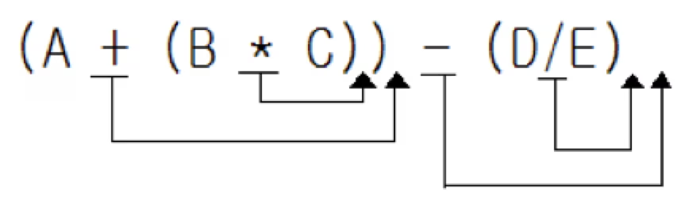

- **문제** : 백준 1918번 : 후위 표기식
- **난이도** : 골드 2
- **문제 유형** : 스택
- **푼 언어** : Python

## 01. 문제 설명
수식은 일반적으로 3가지 표기법으로 표현할 수 있다. 연산자가 피연산자 가운데 위치하는 중위 표기법(일반적으로 우리가 쓰는 방법이다), 연산자가 피연산자 앞에 위치하는 전위 표기법(prefix notation), 연산자가 피연산자 뒤에 위치하는 후위 표기법(postfix notation)이 그것이다. 예를 들어 중위 표기법으로 표현된 a+b는 전위 표기법으로는 +ab이고, 후위 표기법으로는 ab+가 된다.

이 문제에서 우리가 다룰 표기법은 후위 표기법이다. 후위 표기법은 위에서 말한 법과 같이 연산자가 피연산자 뒤에 위치하는 방법이다. 이 방법의 장점은 다음과 같다. 우리가 흔히 쓰는 중위 표기식 같은 경우에는 덧셈과 곱셈의 우선순위에 차이가 있어 왼쪽부터 차례로 계산할 수 없지만 후위 표기식을 사용하면 순서를 적절히 조절하여 순서를 정해줄 수 있다. 또한 같은 방법으로 괄호 등도 필요 없게 된다. 예를 들어 a+b*c를 후위 표기식으로 바꾸면 abc*+가 된다.

중위 표기식을 후위 표기식으로 바꾸는 방법을 간단히 설명하면 이렇다. 우선 주어진 중위 표기식을 연산자의 우선순위에 따라 괄호로 묶어준다. 그런 다음에 괄호 안의 연산자를 괄호의 오른쪽으로 옮겨주면 된다.

예를 들어 a+b*c는 (a+(b*c))의 식과 같게 된다. 그 다음에 안에 있는 괄호의 연산자 *를 괄호 밖으로 꺼내게 되면 (a+bc*)가 된다. 마지막으로 또 +를 괄호의 오른쪽으로 고치면 abc*+가 되게 된다.

다른 예를 들어 그림으로 표현하면 A+B*C-D/E를 완전하게 괄호로 묶고 연산자를 이동시킬 장소를 표시하면 다음과 같이 된다.



결과: ABC*+DE/-

이러한 사실을 알고 중위 표기식이 주어졌을 때 후위 표기식으로 고치는 프로그램을 작성하시오

### 입력
첫째 줄에 중위 표기식이 주어진다. 단 이 수식의 피연산자는 알파벳 대문자로 이루어지며 수식에서 한 번씩만 등장한다. 그리고 -A+B와 같이 -가 가장 앞에 오거나 AB와 같이 *가 생략되는 등의 수식은 주어지지 않는다. 표기식은 알파벳 대문자와 +, -, *, /, (, )로만 이루어져 있으며, 길이는 100을 넘지 않는다. 

### 출력
첫째 줄에 후위 표기식으로 바뀐 식을 출력하시오

## 02. 문제 풀이
LIFO(선입후출) 구조인 **스택(Stack)**을 활용해 수식을 후위 표기식으로 변환하였다.

입력받은 수식을 한 글자씩 순회하면서 다음과 같은 규칙을 적용했다.
먼저 **알파벳(피연산자)** 인 경우에는 바로 result에 추가하였다.

다음으로 '('는 stack에 그대로 넣었으며, ')'를 만나면 stack에서 '('가 나올 때까지 연산자를 꺼내 result에 추가하였다.

마지막으로 연산자(+, -, *, /)를 만났을 때는 스택의 top에 있는 연산자와 **우선순위(rank)** 를 비교했다. 만약 스택의 top에 있는 연산자의 우선순위가 현재 연산자보다 높거나 같다면, 스택에서 pop하여 result에 추가한 뒤 현재 연산자를 스택에 넣었다.

이 과정을 반복한 후, 스택에 남아 있는 연산자들을 모두 result에 추가하여 후위 표기식을 완성했다.

  <코드>
```Python
expression = input()  # 수식
stack = []
result = ''
operator = {'+', '-', '*', '/'}
rank = {'+': 1, '-': 1, '*': 2, '/': 2}

for ch in expression:
    if 'A' <= ch <= 'Z':
            result += ch

    elif ch == '(':
        stack.append(ch)

    elif ch == ')' :
        while stack[-1] != '(':
            result += stack.pop()

        stack.pop()  # '(' 제거

    else:
        while stack and stack[-1] in operator and rank[stack[-1]] >= rank[ch]:
            result += stack.pop()

        stack.append(ch)


while stack:
    result += stack.pop()

print(result)

```
